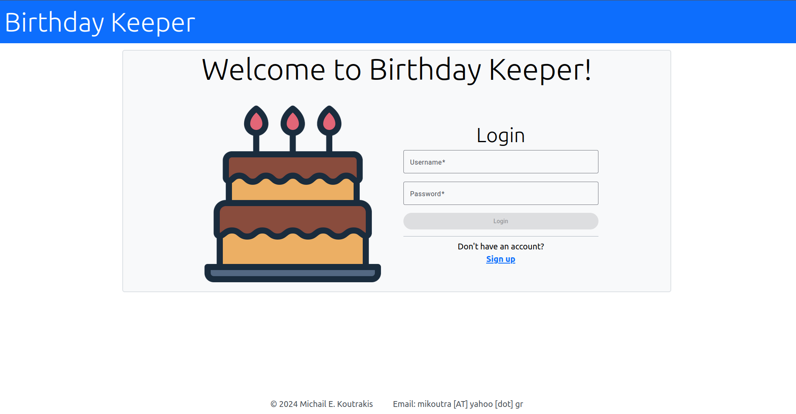
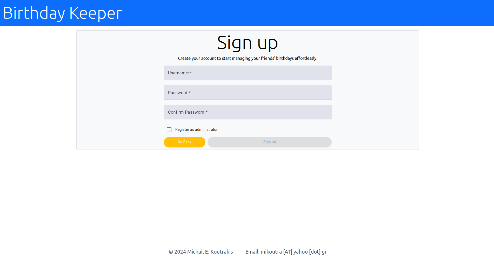
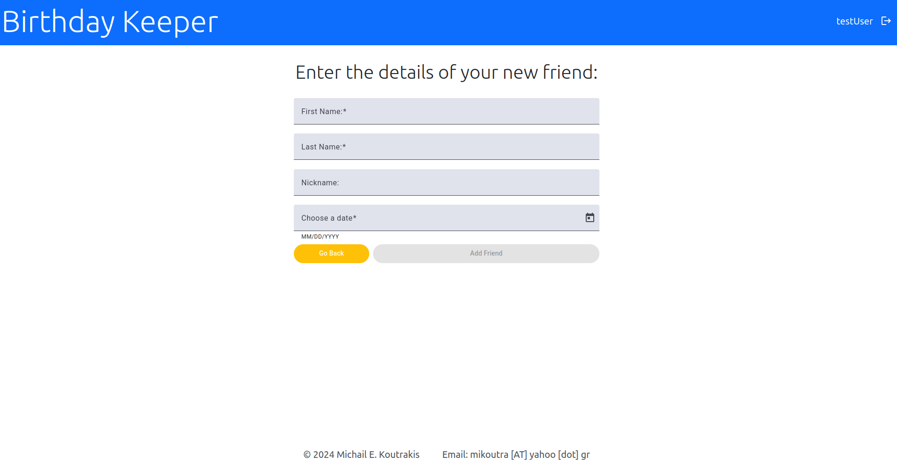
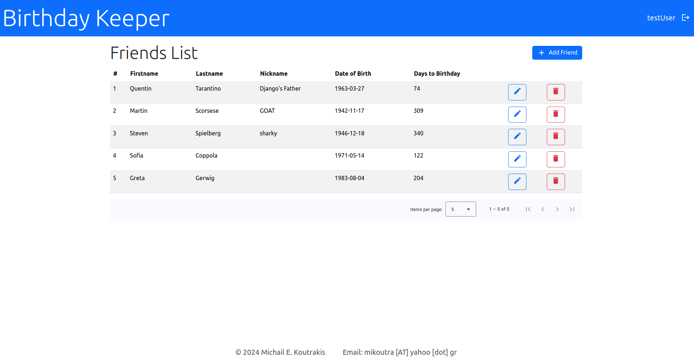

# Birthday-Keeper Angular Front End

This is the Angular front end for the [Birthday-Keeper REST API](https://github.com/mkoutra/birthday-keeper).

This project was generated with [Angular CLI](https://github.com/angular/angular-cli) version **18.2.8**.

## Prerequisites

1. **Clone and run the Birthday-Keeper REST API**: Follow the instructions specified [here](https://github.com/mkoutra/birthday-keeper).

## Development Setup

### Option 1: Docker

1. **Ensure Docker is installed and running on your system**.

2. **Build the Docker image**:
   ```bash
   docker build -t birthday-keeper-front-img .
   ```
3. **Run the Docker container**:
   ```bash
   docker run -p 4200:80 --name birthday-keeper-front-container birthday-keeper-front-img
   ```
4. **Access the application**:
   Open your browser and navigate to [http://localhost:4200](http://localhost:4200).


### Option 2: Local Development

1. **Ensure Node.js and npm are installed**: The application was developed with **node v20.17.0** and **npm 10.8.2**.

2. **Install Angular CLI**: Ensure Angular CLI version 18.2.8 is installed on your system. Run:
   ```bash
   npm install -g @angular/cli@18.2.8
   ```

3. **Clone this repository**:
   ```bash
   git clone https://github.com/mkoutra/birthday-keeper-angular.git
   cd birthday-keeper-angular
   ```
4. **Install dependencies**:
   ```bash
   npm install
   ```
5. **Run the development server**:
   ```bash
   ng serve
   ```
6. **Access the application**:
   Open your browser and navigate to [http://localhost:4200](http://localhost:4200).

## Build

To build the project for production:

1. Run:
   ```bash
   ng build
   ```
2. The build artifacts will be stored in the `dist/` directory.

## Screenshots

- **Login Page**:

  

- **Sign-Up Page**:

  

- **Add Friend**:

  

- **Friends List**:

  

- **Admin Users List**:

  
